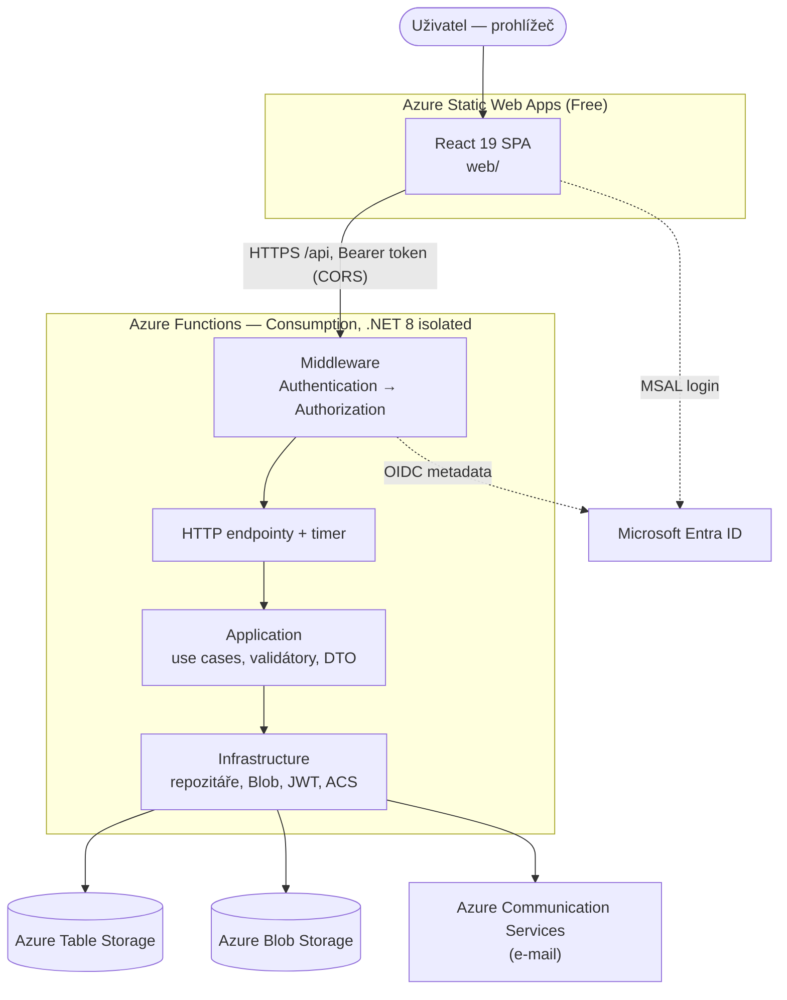

# Architektura — Oáza Zadní Kopanina

> Popis odpovídá kódu na větvi `develop` (září 2026). Obchodní logika vyúčtování je samostatně v [VYUCTOVANI.md](VYUCTOVANI.md), seznam endpointů v [API.md](API.md).

---

## 1. Přehled

- **Frontend** je statická SPA na SWA Free. Na Free tieru není Linked Backend, proto SPA volá Functions **přímo přes CORS** (`VITE_API_BASE_URL`).
- **Backend** je jedna Functions App (Consumption plan). První požadavek po nečinnosti může trvat 5–10 s (cold start).
- **Úložiště** je pouze Azure Table + Blob Storage (LRS). Žádná relační DB, žádné EF Core — všechna agregace probíhá v aplikační vrstvě.
- **Provozní náklady** cílí na jednotky až nízké desítky Kč měsíčně.

---

## 2. Vrstvy backendu (Clean Architecture)

| Projekt | Obsah | Závisí na |
|---------|-------|-----------|
| `Oaza.Domain` | entity, enumy, konstanty (`TableNames`, `PartitionKeys`, `BlobContainerNames`), rozhraní repozitářů, helpery (`InvertedTimestamp`, `TokenHasher`) | — |
| `Oaza.Application` | use cases (`UseCases/`), DTO, FluentValidation validátory, `EntityMapper`, `AppException`, rozhraní služeb (e-mail, blob, cache) | Domain |
| `Oaza.Infrastructure` | Table Storage repozitáře (`TableStorageRepository<T>`, `TableEntityMapper`), `BlobStorageService`, `JwtService`, `EntraIdTokenValidator`, `AcsEmailService`, `NotificationService`, `DependencyInjection` | Application, Domain |
| `Oaza.Functions` | `Program.cs` (DI, middleware), HTTP endpointy (`Endpoints/`), timer (`Triggers/`), atributy `[RequireRole]`/`[AllowAnonymous]` | vše |

Konvence:

- Každý endpoint vrací DTO, nikdy doménovou entitu. JSON je camelCase.
- Validace přes FluentValidation → 400 s polem `errors` (viz [API.md](API.md#chyby)).
- Peníze jsou vždy `decimal`. V Table Storage se ukládají jako **řetězec v invariant kultuře** (`G29`), aby nedošlo ke ztrátě přesnosti.
- Jednodušší logika žije přímo v endpointech; složitější výpočty mají vlastní use case (`CalculateSettlementUseCase`, `CloseBillingPeriodUseCase`, `CalculateHouseSaldoUseCase`, `ImportReadingsUseCase`, …).

---

## 3. Datový model

### 3.1 Tabulky (Azure Table Storage)

| Tabulka | Entita | PartitionKey | RowKey | Poznámka |
|---------|--------|--------------|--------|----------|
| `Users` | `User` | `USER` | GUID | hash magic-link tokenu, rate-limit a lockout čítače |
| `Houses` | `House` | `HOUSE` | GUID | `IsActive`, `DissolveOverpayment` |
| `WaterMeters` | `WaterMeter` | `METER` | GUID | `Type` Main/Individual, `MeterNumber`, `RadioAddress`, `Name` |
| `MeterReadings` | `MeterReading` | ID vodoměru | invertovaný timestamp (`DateTime.MaxValue.Ticks − ticks`) | nejnovější odečty první |
| `BillingPeriods` | `BillingPeriod` | `PERIOD` | GUID | součet faktur se neukládá |
| `SupplierInvoices` | `SupplierInvoice` | `INVOICE` | GUID | řádky faktury jako JSON (`LineItemsJson`) |
| `AdvancePayments` | `AdvancePayment` | ID domu | viz níže | zálohy, doplatky, výplaty, počáteční stavy |
| `Settlements` | `Settlement` | ID období | ID domu | snapshot při uzavření období |
| `Documents` | `Document` | kategorie (`stanovy`, `zapisy`, `smlouvy`, `ostatni`) | GUID | |
| `DocumentVersions` | `DocumentVersion` | ID dokumentu | číslo verze (`D3`, např. `004`) | posledních 10 verzí |
| `FinancialRecords` | `FinancialRecord` | rok `YYYY` | GUID | příjmy/výdaje spolku |
| `AdvanceSettings` | `AdvanceSettings` | `SETTINGS` | `advances` | singleton; název tabulky je natvrdo v `AdvanceSettingsRepository` |

RowKey v `AdvancePayments` podle typu platby:

| Typ | RowKey |
|-----|--------|
| `Advance` (měsíční záloha) | `YYYY-MM` — jedna na dům a měsíc |
| `Doplatek` | `D-{invertedTicks}-{guid}` |
| `Payout` (výplata přeplatku) | `V-…` |
| `OpeningBalance` | `O-…` |
| doplatek z fondu při uzavření | `FUND-{periodId}` (deterministický — opakování přepíše) |

Tabulky i kontejnery se vytvářejí automaticky při prvním přístupu (`CreateIfNotExistsAsync`).

Protože Table Storage nemá JOINy ani cizí klíče, integritu vztahů (dům ↔ vodoměr ↔ uživatel) hlídá aplikační kód. Objem dat je malý (8 domů, desítky odečtů ročně), takže se běžně načítají celé partition a filtruje se v paměti.

### 3.2 Blob Storage

| Kontejner | Cesta | Obsah |
|-----------|-------|-------|
| `documents` | `{kategorie}/{docId}/{název}{přípona}`, verze `{kategorie}/{docId}/v{n}/…` | dokumenty spolku (max 20 MB; PDF, DOCX, XLSX, JPG, PNG) |
| `invoices` | `{invoiceId}/faktura-{yyyy}-{MM}.pdf` | PDF faktur dodavatele vody |
| `finance` | `{recordId}/faktura.pdf` | PDF příloh finančních záznamů |
| `settlements` | `{periodId}/{houseId}.pdf` | vygenerovaná PDF vyúčtování (cache) |

Všechny kontejnery jsou privátní; stahování jde přes API.

---

## 4. Autentizace

API přijímá `Authorization: Bearer <token>` se dvěma druhy tokenů. `AuthenticationMiddleware` zkusí nejdřív vlastní JWT, pak Entra ID token.

### 4.1 Microsoft Entra ID (primární)

1. SPA přihlásí uživatele přes MSAL (`loginRedirect`, scopes `openid profile email`, cache v `sessionStorage`).
2. SPA posílá **ID token** (ne access token) — `acquireTokenSilent`, při nutnosti interakce `acquireTokenRedirect`.
3. `EntraIdTokenValidator` ověří podpis přes OIDC metadata tenantu, issuer `https://login.microsoftonline.com/{TenantId}/v2.0` a audience = `EntraId__ClientId`.
4. Uživatel se dohledá v `Users` podle `oid`, pak podle e-mailu. Neexistuje-li → **403** (uživatele musí předem založit admin).

Pokud `EntraId__TenantId`/`ClientId` nejsou nastavené, je Entra přihlášení vypnuté.

### 4.2 Magic link (záložní)

1. `POST /auth/magic-link { email }` — vždy vrátí 200 (neprozrazuje, zda e-mail existuje).
2. Pro existujícího uživatele se vygeneruje GUID token; do DB se ukládá jen jeho **SHA-256 hash**, platnost **15 minut**. Limit **3 žádosti za hodinu**.
3. ACS pošle odkaz `{AppUrl}/auth/verify?token=…&email=…`.
4. `POST /auth/magic-link/verify { token, email }` → vlastní JWT (HS256, `JwtSecret`, platnost **24 h**). Token je jednorázový; po **5 neúspěšných** pokusech se zneplatní.
5. SPA drží JWT jen v paměti (React state) — obnovení stránky = nové přihlášení.

Claims vlastního JWT: `sub` (ID uživatele), `email`, `role`, `authMethod`, `houseId` (je-li).

### 4.3 Autorizace

`AuthorizationMiddleware` čte atributy na metodě endpointu:

- `[AllowAnonymous]` — bez přihlášení (`auth/magic-link`, `auth/magic-link/verify`, `seed`),
- `[RequireRole(...)]` — jen uvedené role, jinak 403,
- bez atributu — kterýkoli přihlášený uživatel.

Všechny funkce mají `AuthorizationLevel.Anonymous` (bez function keys) — **ochranu zajišťuje výhradně middleware**. Omezení „člen vidí jen svůj dům" je řešeno uvnitř jednotlivých endpointů (viz [API.md](API.md)).

---

## 5. Role a oprávnění

| Oblast | Člen (`Member`) | Účetní (`Accountant`) | Admin |
|--------|-----------------|-----------------------|-------|
| Přehled (dashboard) | vlastní dům | jako člen | celé sdružení |
| Odečty — přehled | vlastní vodoměr + hlavní | hlavní vodoměr* | vše, vč. ztráty |
| Odečty — seznam, oprava, import | — | — | ✔ |
| Zálohy — nastavení a výpočet | vlastní dům | všechny domy (jen čtení) | čtení i úpravy |
| Saldo a platby | vlastní dům | všechny domy (jen čtení) | vše + zápis plateb |
| Vyúčtování | uzavřená období, vlastní dům, PDF | jako člen | správa období, výpočet, uzavření, PDF/ZIP, faktury za vodu |
| Přehled faktur | — | ✔ | ✔ |
| Hospodaření | záznamy a souhrny | + export PDF/XLSX, fond, přílohy | + přidávání záznamů |
| Dokumenty | čtení a stažení | čtení a stažení | + nahrávání, verze, mazání |
| Administrace (domy, uživatelé, vodoměry) | — | — | ✔ |

\* Účetní obvykle nemá přiřazený dům, API mu proto v `GET /readings` vrací jen data vlastního domu (tj. nic) a UI zobrazí jen hlavní vodoměr.

Pozor: některá data jsou pro všechny přihlášené bez omezení — seznam domů vč. kontaktů, vodoměry, zúčtovací období, dokumenty a finanční záznamy.

---

## 6. Frontend

- **React 19 + TypeScript (strict)**, **Vite 8**, **Tailwind CSS 4** (konfigurace v CSS, bez `tailwind.config`), **React Router 7**, **MSAL** (`@azure/msal-browser` 4, `@azure/msal-react` 3), **Recharts 3**, ikony **lucide-react**.
- Bez state-management knihovny — `AuthContext` + hooky.
- Struktura `web/src/`:
  - `api/` — jeden modul na zdroj, typované funkce nad `apiClient` (`client.ts`); binární upload/download přes `fetch`,
  - `auth/` — `AuthContext`, `msalConfig`,
  - `components/` — sdílené komponenty (`Layout`, `ProtectedRoute`, `MetricCard`, `ConsumptionChart`, `components/help/*`),
  - `content/help.ts` — **jediný zdroj textů nápovědy v UI** (viz níže),
  - `hooks/useApi.ts` — `useApi(fetcher, deps)` → `{ data, loading, error, refetch }`,
  - `pages/` — stránky (routy), `pages/admin/` — administrace,
  - `types/index.ts` — TS typy zrcadlící DTO z API,
  - `utils/number.ts` — `parseCzechNumber`.
- Formátování: `Intl.NumberFormat('cs-CZ')` a `Intl.DateTimeFormat('cs-CZ')`.
- `staticwebapp.config.json` (kopíruje se z `web/public/` do `dist/`): SPA fallback, přesměrování 401 → `/login`, bezpečnostní hlavičky a CSP.

### Routy

| Cesta | Stránka | Přístup |
|-------|---------|---------|
| `/login`, `/auth/verify` | přihlášení, ověření magic linku | veřejné |
| `/dashboard` | Přehled | přihlášení |
| `/readings` | Odečty | přihlášení |
| `/readings/list`, `/readings/import` | Seznam / import odečtů | Admin |
| `/advances` | Zálohy | přihlášení |
| `/saldo` | Saldo a platby | přihlášení |
| `/billing` | Vyúčtování | přihlášení |
| `/prehled-faktur` | Přehled faktur | Účetní, Admin |
| `/documents` | Dokumenty | přihlášení |
| `/finance` | Hospodaření | přihlášení |
| `/jak-to-funguje` | Nápověda a slovník pojmů | přihlášení |
| `/admin/houses`, `/admin/users`, `/admin/meters` | Administrace | Admin |
| `/admin/cost-components` | Nákladové složky (T02): metoda a účast domů v čase, úseky | Admin |
| `/admin/opening-balances` | Počáteční stavy (T03): start účtování, stavy vodoměrů s návrhem z odečtů, podíly ve fondu, kredity složek s náhledem | Admin |
| `/admin/audit` | Audit změn (X4) | Admin |

### Nápověda v UI (`web/src/content/help.ts`)

Uživatelská dokumentace žije přímo v aplikaci. Modul obsahuje:

- `terms` — pojmy do slovníku (`label`, `short`, `long`); v UI jako `<HelpTerm id="…"/>` („?" s odkazem na `/jak-to-funguje#id`),
- `sections` — krátká poznámka pod nadpisem (`<HelpNote>`) a rozbalovací vysvětlení (`<HelpDisclosure>`),
- `guides` — průvodci na stránce **Jak to funguje**.

ID pojmů a sekcí jsou TS union typy, takže překlep neprojde buildem. Nový pojem: přidat ID do `TermId`, záznam do `terms`, umístit `<HelpTerm>` — ve slovníku se objeví automaticky. Texty nesmí tvrdit nic, co nejde doložit kódem; komentáře v hlavičce souboru mapují texty na use cases, aby se při změně výpočtu daly dohledat. Návrh: [specs/2026-08-01-dokumentace-v-ui-design.md](superpowers/specs/2026-08-01-dokumentace-v-ui-design.md).

---

## 7. E-maily a notifikace

Odesílá `AcsEmailService` (Azure Communication Services), sdílená ACS resource pro všechna prostředí.

| E-mail | Spouštěč | Příjemci |
|--------|----------|----------|
| Odkaz pro přihlášení | `POST /auth/magic-link` | žadatel |
| Pozvánka | `POST /users` | nový uživatel |
| Připomínka odečtu | timer `0 0 8 1 * *` (1. den v měsíci 8:00 UTC) nebo ručně | všichni uživatelé se zapnutými notifikacemi |
| Nové odečty importovány | ručně `POST /notifications/send` (`import_completed`) | členové se zapnutými notifikacemi |
| Vyúčtování uzavřeno | ručně `POST /notifications/send` (`settlement_closed`) | členové se zapnutými notifikacemi |

Import ani uzavření období notifikace automaticky **neposílají**. Selhání odeslání se loguje a nepřeruší operaci.

---

## 8. Prostředí a CI/CD

| Prostředí | Branch | Workflow | Resource group | Doména |
|-----------|--------|----------|----------------|--------|
| DEV | `develop` | `deploy-dev.yml` | `rg-oaza-dev` | `oaza-dev.cendelinovi.cz` |
| TEST | `release/**` | `deploy-test.yml` | `rg-oaza-test` | `oaza-test.cendelinovi.cz` |
| PROD | `master` | `deploy.yml` | `rg-oaza-prod` | `oaza.cendelinovi.cz` |

Každý workflow: build + test API (s Azurite jako service containerem) → lint + build webu → deploy Functions (`Azure/login` + `az functionapp deployment source config-zip`) a SWA (`Azure/static-web-apps-deploy`). Build webu dostává `VITE_*` z GitHub secrets (`{DEV|TEST|PROD}_ENTRA_CLIENT_ID`, `…_ENTRA_TENANT_ID`, `…_API_BASE_URL`); deploy používá `AZURE_CREDENTIALS` a `{…}_SWA_API_TOKEN`.

Postup založení prostředí: [DEPLOYMENT-DEV.md](DEPLOYMENT-DEV.md), [DEPLOYMENT-TEST-PROD.md](DEPLOYMENT-TEST-PROD.md).
